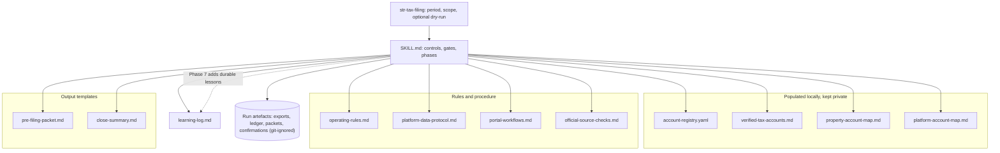

# System architecture

## Overview

The repository is a Claude Code skill: instructions and reference data, with no executable code, no dependencies and no build. Claude runs it by reading the files in a fixed order. It then works through platform reports and government portals, and a human handles authentication and approvals.

It has four layers:

1. **Entry procedure: SKILL.md.** It holds:
   - the frontmatter (manual invocation, argument hint) and the fixed load order;
   - the hard security boundary and the account-number authority rule;
   - twelve non-negotiable controls and the two approval gates;
   - phases 0 to 7 and the completion standard.

   Everything else is loaded from here.
2. **Private data layer (shipped as templates).** These files ship with placeholders, to be populated locally and kept private. See [[verified-account-registry]] and [[public-template-sanitization]].
   - `resources/account-registry.yaml`: the machine-readable government account registry.
   - `resources/verified-tax-accounts.md`: what to record for each account, and why.
   - `resources/property-account-map.md`: how properties group into entities and accounts, with known traps.
   - `resources/platform-account-map.md`: which listings sit in which platform account.
3. **Rules and procedure layer.**
   - `resources/operating-rules.md`: source hierarchy, identifier integrity, deadline and marketplace controls, risk levels.
   - `resources/platform-data-protocol.md`: what to gather from each platform, and the fields of the normalised ledger.
   - `resources/portal-workflows.md`: the filing procedure for each portal.
   - `resources/official-source-checks.md`: official sources to verify again each period, with a last-reviewed date.
4. **Knowledge and output layer.**
   - `resources/learning-log.md`: durable procedural lessons from real cycles, with identifiers stripped. The skill adds to it in Phase 7.
   - `templates/pre-filing-packet.md`: the Gate 1 packet, one per return.
   - `templates/close-summary.md`: the period close.

A run produces artefacts outside the tracked files: source exports, worksheets, packets, confirmations, spreadsheets and PDFs. `.gitignore` excludes the directories and file types they would use. SKILL.md does not say where a run writes its outputs; the directory names come only from `.gitignore` (inferred).

## Module graph

## Constraints

- **No code.** Every behaviour is an instruction, so correctness depends on Claude following the load order and the controls. Nothing enforces them mechanically: there are no tests and no CI (inferred from the file list).
- **Fixed load order.** SKILL.md lists all eleven resource and template files. A new file must be added there to be read.
- **Where the jurisdiction-specific content sits.** It is in SKILL.md's filing universe, `portal-workflows.md`, `official-source-checks.md` and parts of `operating-rules.md`. The phases, gates, controls and templates are generic (inferred from the files).
- **Live screens win.** Live portal labels and account screens override anything written in the workflows; `portal-workflows.md` opens with this rule. See [[source-of-truth-hierarchy]].
- **Nothing sensitive in the files.** The private data layer must never be committed once populated, and no file may hold secrets. See [[safety-model]].
