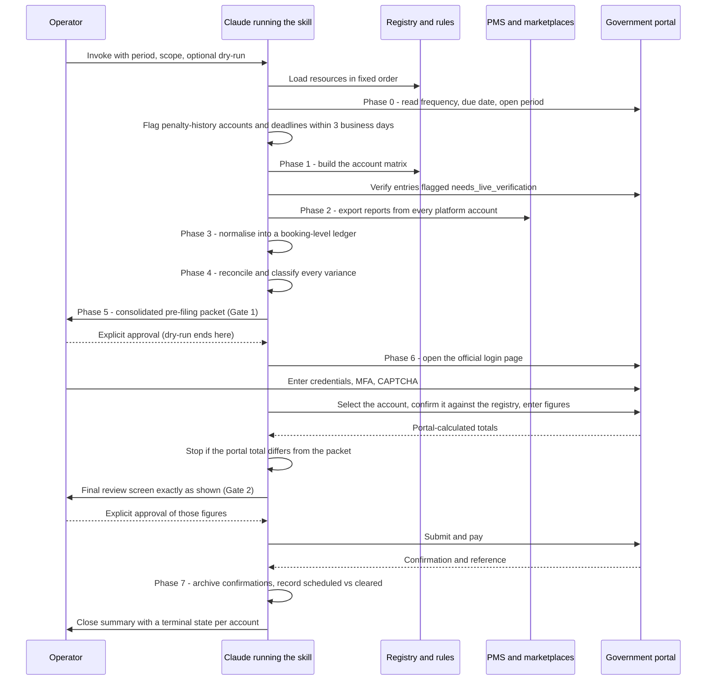

# Key flows

## End-to-end path of a typical request

A filing run covers one period and one scope, for example one month for one state or one quarter for all states. With `dry-run`, the run stops after Gate 1, and nothing is submitted or changed.

The Phase 1 account matrix maps property, entity, platform account, jurisdiction, tax type, government account and filing frequency.

## Other important flows

- **Account mismatch at entry.** If the portal shows an account number that doesn't match the registry, the run stops. The mapping is resolved before any figures are entered. See [[verified-account-registry]].
- **Portal error mid-filing.** After any portal error, check the status of the return or row before filing again; never re-submit blind. Before handing over for authentication, confirm which account the session is actually signed into (resources/learning-log.md, "Portal behaviour").
- **Filing by template upload.** Some returns are filed by uploading the authority's own spreadsheet. The rules (resources/learning-log.md; resources/portal-workflows.md):
  - write literal values, not formulas, at full precision;
  - keep the workbook structure unchanged;
  - verify each row's account before writing to it;
  - use the required file format.

  A missing property row stops the upload path.
- **PMS tax mismatch.** When expected tax differs from what the PMS collected, the run:
  1. keeps the verified base;
  2. files what current rules require;
  3. logs the over- or under-collection;
  4. opens a separate authorised audit after filing.

  Tax settings are never changed during the run. See [[booking-level-reconciliation]].
- **Separate filing and payment.** Where filing and payment are separate irreversible actions, each needs its own Gate 2 approval, unless both were listed and approved together. See [[two-approval-gates]].
- **Close.** Each account must end in one of four states:
  - filed and paid or scheduled, confirmed;
  - zero return filed, confirmed;
  - not due, documented;
  - blocked, with an owner and a next action.

  A period is closed only when every in-scope account is. Unresolved issues carry forward to the next run.
- **Learning capture.** Phase 7 adds to resources/learning-log.md only durable, verified procedural facts or mappings the operator confirmed, and never secrets.
