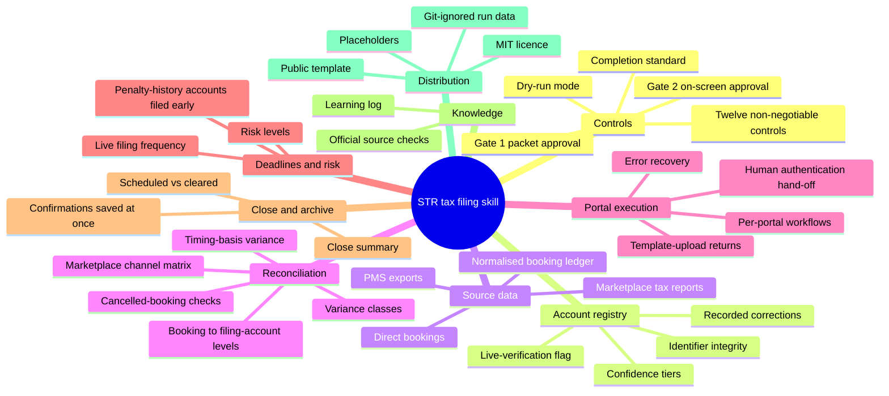

# Feature mindmap

## Feature mindmap

## Where each branch is explained

- Controls and gates: [[two-approval-gates]], [[safety-model]]
- Account registry: [[verified-account-registry]]
- Source data and reconciliation: [[booking-level-reconciliation]]
- Rates, rules and which source wins: [[source-of-truth-hierarchy]]
- Distribution: [[public-template-sanitization]]
