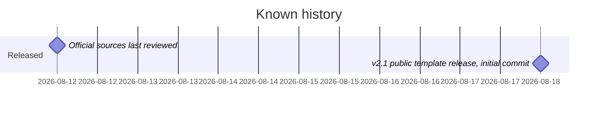

# Roadmap

## Milestones

The repository contains no plan. This page shows the dated history visible in the repository, then candidate work implied by open questions. None of the candidates is a commitment.

- v2.0 introduced the structure and the safety model. It came before the public release, but its date isn't recorded. See CHANGELOG.md.
- v2.1 is the public template release. See CHANGELOG.md for what it added.

## Candidate work (inferred, not confirmed)

- Verify `resources/official-source-checks.md` again against current official sources. Its last-review date is the only freshness marker, and every control assumes current sources.
- Settle how a populated registry is loaded while staying private: `.gitignore` expects `.local` file names, but the load order in SKILL.md never reads them. See [[public-template-sanitization]].
- Align the registry template's version string with the CHANGELOG.
- If more jurisdictions are to be added, as the README suggests is possible, separate the state-specific content from the generic procedure.

## Open questions

- Is further development planned, and on what cadence? The repository doesn't say.
