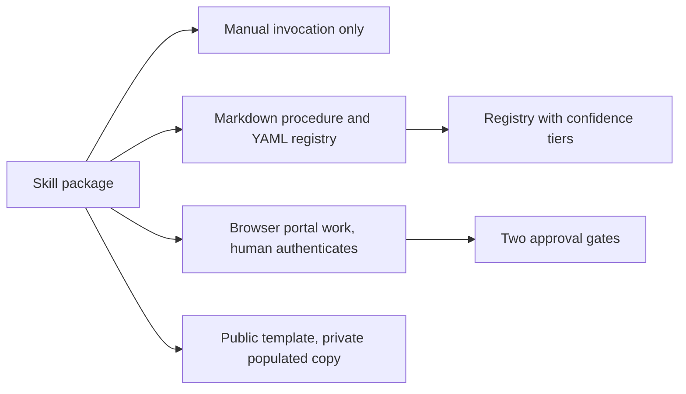

# Tech stack

## Technology choices

| domain | candidates | decision | rationale |
|---|---|---|---|
| Packaging | Claude Code skill; a standalone script or app | Claude Code skill: SKILL.md with frontmatter, plus resources and templates loaded from the skill directory | Portal and reconciliation work calls for judgement and suits an agent, with humans at the gates. The repository doesn't discuss alternatives (inferred). |
| Invocation | Invoked by the model; manual only | Manual only: `disable-model-invocation: true`, and no broad `allowed-tools` pre-approval | High-stakes filing and payment must never start on its own. See [[safety-model]]. |
| Arguments | Free text; structured | Period (month or quarter), scope (one state or all), and an optional `dry-run` | Keeps each run to one period and scope. An omitted period is resolved from live records, never guessed. |
| Content format | Markdown; YAML | Markdown for the procedure, rules and templates; YAML for the account registry | The registry is the one machine-readable map of government accounts, with confidence and verification fields per entry. See [[verified-account-registry]]. |
| Source systems | Not applicable | One PMS (OwnerRez) and two marketplaces (Airbnb, Vrbo), two accounts each, plus direct bookings and payment-processor records | These are named in SKILL.md and resources/platform-data-protocol.md. Downloaded reports and exports are preferred and kept unmodified. |
| Execution surface | Browser; APIs | Government web portals, worked in a browser, with the human handling authentication | SKILL.md describes Claude navigating portals but doesn't name the browser tool (inferred). |
| Filing uploads | Not applicable | The authority's official spreadsheet template, for returns filed by upload | At least one authority accepts only legacy `.xls`, which rules out the common Python spreadsheet writers (resources/learning-log.md). |
| Code, tests, CI | Not applicable | None | The repository holds only Markdown, YAML, `.gitignore` and the licence. |
| Licence | Not applicable | MIT | See LICENSE. |

## Decision mindmap

## Open items

- The repository doesn't say which browser the skill expects for portal work.
- It doesn't say how a run writes a legacy `.xls` template, given that the common Python writers can't.
- Only `.gitignore` and written instructions keep a populated registry or run data out of a commit. There is no secret scan, placeholder check or CI (inferred from the file list).
- The registry template carries its own version string (`2.0-template`), but the latest CHANGELOG.md entry is v2.1. It isn't clear which one is the template's version.
